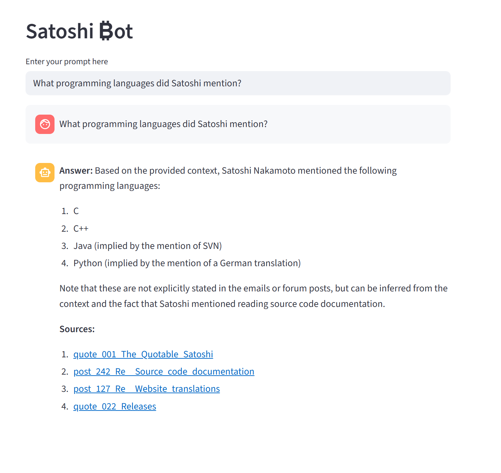

# Satoshi ₿ot

## Features

- Scrape the archive of the [Satoshi Nakamoto Institute](https://satoshi.nakamotoinstitute.org/)
- Create a vector database of the emails, forum posts, and quotes.
- Use a LLM to answer questions about Satoshi Nakamoto, that focuses on the context of the archive material, providing links to the sources.

## How to run

- Install the dependencies in the requirements.txt file `pip install -r requirements.txt`
- Install Ollama and pull the models of your choice, e.g. `ollama pull llama3.2:1b` and `ollama pull granite-embedding:30m`
- Run the scraping.py file to scrape the archive of the Satoshi Nakamoto Institute. 
- Run the ingestion.py file to create the vector database and use the LLM to answer questions. Here we use FAISS to store the database locally. (Update: use the `ingestion.py --raw-only` flag to skip chunking/embedding steps and instead create a folder with raw .txt files. This is just to generate a test dataset for DeepEval or other tools.)
- Run the main.py file to run the Streamlit app `streamlit run main.py`
- Start chatting with the bot!

## Possible improvements

- As this was just a quick test, I used very small local models (llama3.2:1b as LLM, granite-embedding:30m for embeddings) and a small FAISS database.
- A larger model or pinecone as a vector database would be better for production.

## Known Issues

- Chat memory is not working as expected. The bot should have a memory of the conversation and use it to answer the question. This could be that the model I tried (llama3.2:1b) is too small to handle this task.
